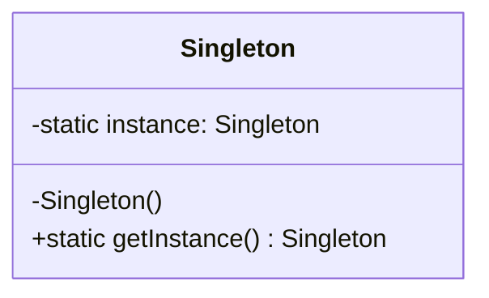

# Catálogo de Patrones de Diseño - Ingeniería de Software II

## Integrantes
* Isabel Correa Sandoval
* Irving Mezo ÁLvarez
* Valeria Rosales Arévalo
* Jorge Arauz Estrada

---

## 1. Singleton
*Categoría: Creacional
* Propósito: Controla el acceso a un recurso compartido asegurando que solo exista una instancia activa en todo el ciclo de vida del software.
* **Estructura UML:**

Java 
'''
public class Singleton {
    private static Singleton instance;
    private Singleton() {} // Constructor privado
    
    public static Singleton getInstance() {
        if (instance == null) {
            instance = new Singleton();
        }
        return instance;
    }
}
'''

Python
'''
class Singleton:
    _instance = None
    def __new__(cls):
        if cls._instance is None:
            cls._instance = super(Singleton, cls).__new__(cls)
        return cls._instance
'''

  
