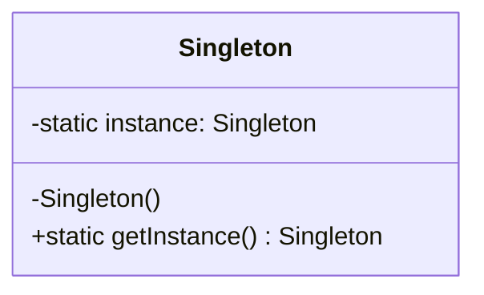

# Catálogo de Patrones de Diseño - Ingeniería de Software II

## Integrantes
* Isabel Correa Sandoval
* Irving Mezo ÁLvarez
* Valeria Rosales Arévalo
* Jorge Arauz Estrada

---

## 1. Singleton
*Categoría: Creacional
* Propósito: Controla el acceso a un recurso compartido asegurando que solo exista una instancia activa en todo el ciclo de vida del software.
* **Estructura UML:**


Java 
```
public class Singleton {
    private static Singleton instance;
    private Singleton() {} // Constructor privado
    
    public static Singleton getInstance() {
        if (instance == null) {
            instance = new Singleton();
        }
        return instance;
    }
}
```

Python
```
class Singleton:
    _instance = None
    def __new__(cls):
        if cls._instance is None:
            cls._instance = super(Singleton, cls).__new__(cls)
        return cls._instance
```


---

## 2. Factory Method
* Categoría: Creacional
* Propósito: Define una interfaz para crear objetos en una superclase, pero permite que las subclases alteren el tipo de objetos que se crearán según la necesidad.
* **Estructura UML:**
```mermaid
classDiagram
    class Creador {
        +metodoFabrica() Producto
    }
    class CreadorConcreto {
        +metodoFabrica() Producto
    }
    class Producto {
        <<interface>>
        +operacion()
    }
    Creador <|-- CreadorConcreto
    Producto <.. CreadorConcreto
 ```

Java
 ```
interface Producto { void operacion(); }

class ProductoConcreto implements Producto {
    public void operacion() { System.out.println("Lógica de producto en Java"); }
}

abstract class Creador {
    public abstract Producto fabricar();
}

class CreadorConcreto extends Creador {
    public Producto fabricar() { return new ProductoConcreto(); }
}
 ```

Python
 ```
from abc import ABC, abstractmethod

# Interfaz del Producto
class Notificacion(ABC):
    @abstractmethod
    def enviar(self):
        pass

# Producto Concreto
class EmailNotificacion(Notificacion):
    def enviar(self):
        print("Enviando notificación por Email...")

# Creador (Factory)
class FabricaNotificaciones(ABC):
    @abstractmethod
    def crear_notificacion(self) -> Notificacion:
        pass

# Creador Concreto
class FabricaEmail(FabricaNotificaciones):
    def crear_notificacion(self) -> Notificacion:
        return EmailNotificacion()

# Uso
fabrica = FabricaEmail()
noticia = fabrica.crear_notificacion()
noticia.enviar()

 ```

**## 3. Observer**
* Categoría: Comportamiento
* Define una suscripción automática para que múltiples objetos reaccionen al instante cuando un componente central cambia su estado.
* **Estructura UML:**
```mermaid
  classDiagram
    class Sujeto {
        -observadores: List
        +suscribir(o)
        +notificar()
    }
    class Observador {
        <<interface>>
        +actualizar()
    }
    Sujeto --> Observador
 ```

Java 

 ```
import java.util.*;

interface Observador { void actualizar(String m); }

class Sujeto {
    private List<Observador> lista = new ArrayList<>();
    public void suscribir(Observador o) { lista.add(o); }
    public void notificar(String msg) { lista.forEach(o -> o.actualizar(msg)); }
}

 ```

Python

 ```

class Sujeto:
    def __init__(self):
        self._observadores = []

    def suscribir(self, obj):
        self._observadores.append(obj)

    def notificar(self, mensaje):
        for o in self._observadores:
            o.actualizar(mensaje)

 ```


    


  
