# Catálogo de Patrones de Diseño - Ingeniería de Software II

## Integrantes
* Isabel Correa Sandoval
* Irving Mezo ÁLvarez
* Valeria Rosales Arévalo
* Jorge Arauz Estrada

---

## 1. Singleton
*Categoría: Creacional
* Propósito: Controla el acceso a un recurso compartido asegurando que solo exista una instancia activa en todo el ciclo de vida del software.
* **Estructura UML:**
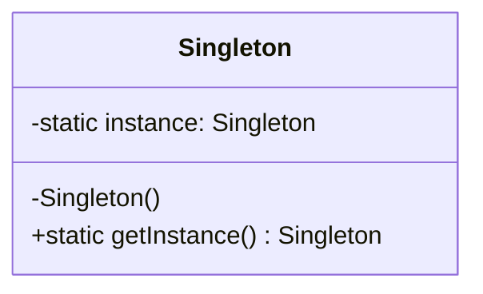

Java 
```
public class Singleton {
    private static Singleton instance;
    private Singleton() {} // Constructor privado
    
    public static Singleton getInstance() {
        if (instance == null) {
            instance = new Singleton();
        }
        return instance;
    }
}
```

Python
```
class Singleton:
    _instance = None
    def __new__(cls):
        if cls._instance is None:
            cls._instance = super(Singleton, cls).__new__(cls)
        return cls._instance
```


---

## 2. Factory Method
* Categoría: Creacional
* Propósito: Define una interfaz para crear objetos en una superclase, pero permite que las subclases alteren el tipo de objetos que se crearán según la necesidad.
* **Estructura UML:**
```mermaid
classDiagram
    class Creador {
        +metodoFabrica() Producto
    }
    class CreadorConcreto {
        +metodoFabrica() Producto
    }
    class Producto {
        <<interface>>
        +operacion()
    }
    Creador <|-- CreadorConcreto
    Producto <.. CreadorConcreto
 ```

Java
 ```
interface Producto { void operacion(); }

class ProductoConcreto implements Producto {
    public void operacion() { System.out.println("Lógica de producto en Java"); }
}

abstract class Creador {
    public abstract Producto fabricar();
}

class CreadorConcreto extends Creador {
    public Producto fabricar() { return new ProductoConcreto(); }
}
 ```

Python
 ```
from abc import ABC, abstractmethod

# Interfaz del Producto
class Notificacion(ABC):
    @abstractmethod
    def enviar(self):
        pass

# Producto Concreto
class EmailNotificacion(Notificacion):
    def enviar(self):
        print("Enviando notificación por Email...")

# Creador (Factory)
class FabricaNotificaciones(ABC):
    @abstractmethod
    def crear_notificacion(self) -> Notificacion:
        pass

# Creador Concreto
class FabricaEmail(FabricaNotificaciones):
    def crear_notificacion(self) -> Notificacion:
        return EmailNotificacion()

# Uso
fabrica = FabricaEmail()
noticia = fabrica.crear_notificacion()
noticia.enviar()

 ```

---

## 3. Observer
* Categoría: Comportamiento
* Propósito: Define una suscripción automática para que múltiples objetos reaccionen al instante cuando un componente central cambia su estado.
* **Estructura UML:**
```mermaid
  classDiagram
    class Sujeto {
        -observadores: List
        +suscribir(o)
        +notificar()
    }
    class Observador {
        <<interface>>
        +actualizar()
    }
    Sujeto --> Observador
 ```

Java 

 ```
import java.util.*;

interface Observador { void actualizar(String m); }

class Sujeto {
    private List<Observador> lista = new ArrayList<>();
    public void suscribir(Observador o) { lista.add(o); }
    public void notificar(String msg) { lista.forEach(o -> o.actualizar(msg)); }
}

 ```

Python

 ```

class Sujeto:
    def __init__(self):
        self._observadores = []

    def suscribir(self, obj):
        self._observadores.append(obj)

    def notificar(self, mensaje):
        for o in self._observadores:
            o.actualizar(mensaje)

 ```

---

## 4. Adapter
* Categoría: Estructural
* Propósito: Funciona como un puente entre dos interfaces incompatibles, permitiendo que clases que normalmente no podrían trabajar juntas lo hagan mediante un objeto "traductor".
* **Estructura UML:**
 ```mermaid
classDiagram
    class Target {
        <<interface>>
        +request()
    }
    class Adapter {
        -adaptee: Adaptee
        +request()
    }
    class Adaptee {
        +specificRequest()
    }
    Target <|-- Adapter
    Adapter --> Adaptee
```

Java 
```

// Interfaz que espera el cliente
interface ConectorSD { void leerDatos(); }

// Clase antigua o incompatible
class TarjetaMicroSD {
    public void lecturaRapida() { 
        System.out.println("Leyendo datos desde MicroSD..."); 
    }
}

// El Adaptador
class AdaptadorSD implements ConectorSD {
    private TarjetaMicroSD microSD = new TarjetaMicroSD();
    
    public void leerDatos() {
        microSD.lecturaRapida();
    }
}

```

Python
```
class TarjetaMicroSD:
    def lectura_rapida(self):
        print("Leyendo datos desde MicroSD...")

class AdaptadorSD:
    def __init__(self, microsd):
        self.microsd = microsd

    def leer_datos(self):
        # Traduce la petición al método que la clase entiende
        self.microsd.lectura_rapida()

# Uso
dispositivo = AdaptadorSD(TarjetaMicroSD())
dispositivo.leer_datos()

```

---

## 5. Strategy
* Categoría: Comportamiento
* Propósito: Define una familia de algoritmos y los encapsula en clases separadas, permitiendo que el algoritmo que usa un objeto pueda cambiar en tiempo de ejecución según la necesidad.
**Estructura UML:**
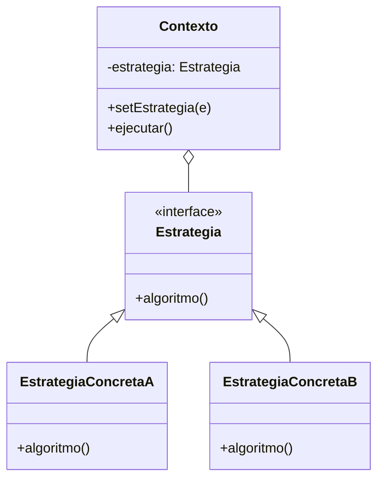

Java 
```
// Interfaz de la estrategia
interface EstrategiaPago { void pagar(int monto); }

// Estrategias concretas
class PagoTarjeta implements EstrategiaPago {
    public void pagar(int m) { System.out.println("Pagando " + m + " con Tarjeta"); }
}

class PagoPaypal implements EstrategiaPago {
    public void pagar(int m) { System.out.println("Pagando " + m + " con PayPal"); }
}

// Clase que usa la estrategia
class Carrito {
    private EstrategiaPago metodo;
    public void setMetodo(EstrategiaPago e) { this.metodo = e; }
    public void procesar(int m) { metodo.pagar(m); }
}

```

Python 
```
class PagoTarjeta:
    def pagar(self, monto):
        print(f"Pagando {monto} con Tarjeta")

class PagoPaypal:
    def pagar(self, monto):
        print(f"Pagando {monto} con PayPal")

class Carrito:
    def __init__(self, estrategia):
        self.estrategia = estrategia

    def procesar(self, monto):
        self.estrategia.pagar(monto)

# Uso: c = Carrito(PagoTarjeta()); c.procesar(100)

```

---

## 6. Proxy
* Categoría: Estructural
* Propósito: Proporciona un sustituto o intermediario para otro objeto con el fin de controlar el acceso a él, permitiendo añadir lógica adicional como seguridad o carga perezosa.
**Estructura UML:**
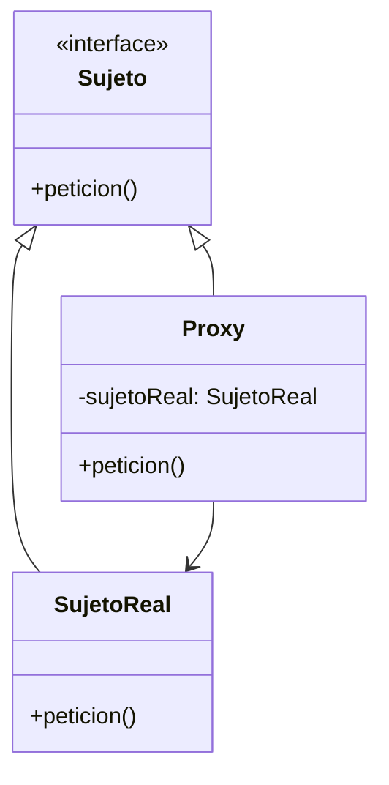

Java
```
interface Internet { void conectar(String url); }

class InternetReal implements Internet {
    public void conectar(String url) { System.out.println("Conectando a: " + url); }
}

class ProxyInternet implements Internet {
    private InternetReal internet = new InternetReal();
    private static List<String> bloqueados = Arrays.asList("sitio-prohibido.com");

    public void conectar(String url) {
        if(bloqueados.contains(url)) System.out.println("Acceso Denegado");
        else internet.conectar(url);
    }
}

```

Python
```
class InternetReal:
    def conectar(self, url):
        print(f"Conectando a: {url}")

class ProxyInternet:
    def __init__(self):
        self.internet_real = InternetReal()
        self.bloqueados = ["sitio-prohibido.com"]

    def conectar(self, url):
        if url in self.bloqueados:
            print("Acceso Denegado por el Proxy")
        else:
            self.internet_real.conectar(url)

# Uso
red = ProxyInternet()
red.conectar("google.com")

```

## 7. Abstract Method
*Categoría: Creacional
* Propósito: Proporciona una interfaz para crear familias de objetos relacionados sin especificar sus clases concretas.
* **Estructura UML:**
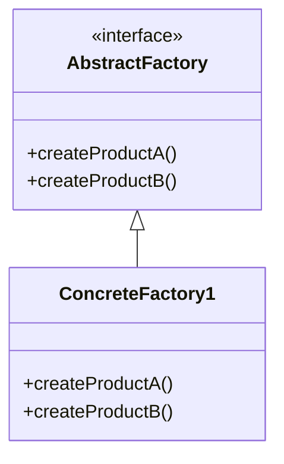

Java
```
interface AbstractFactory {
    Button createButton();
}
class WinFactory implements AbstractFactory {
    public Button createButton() { return new WinButton(); }
}

```

Python
```
from abc import ABC, abstractmethod

class AbstractFactory(ABC):
    @abstractmethod
    def create_button(self):
        pass

class WinFactory(AbstractFactory):
    def create_button(self):
        return WinButton()

```

## 8. Prototype
**Categoría:** Creacional

**Propósito:** Permite copiar objetos existentes sin que el código dependa de sus clases, delegando el proceso de clonación al propio objeto que se está clonando.

### Estructura UML (Mermaid)
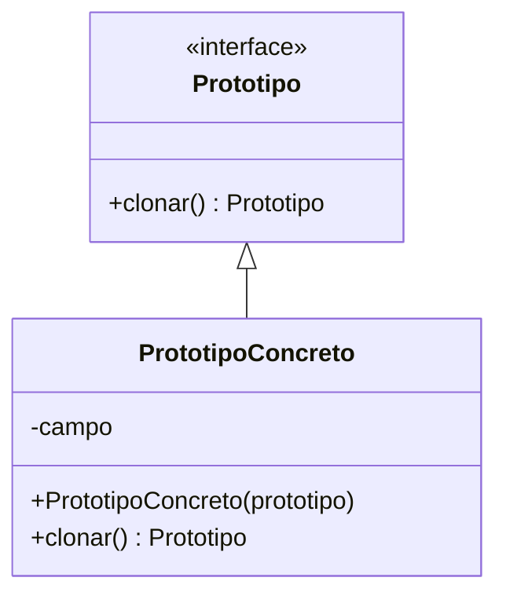
java
```
// Interfaz
interface Prototipo extends Cloneable {
    Prototipo clonar();
}

// Clase Concreta
class Rectangulo implements Prototipo {
    private int ancho;
    private int alto;

    public Rectangulo(int w, int h) {
        this.ancho = w;
        this.alto = h;
    }

    // Lógica de clonación
    public Prototipo clonar() {
        return new Rectangulo(this.ancho, this.alto);
    }

    public String toString() {
        return "Rectangulo " + ancho + "x" + alto;
    }
}

// Uso
// Rectangulo r1 = new Rectangulo(10, 20);
// Rectangulo r2 = (Rectangulo) r1.clonar();
```
python
```
import copy

class Prototipo:
    def clonar(self):
        return copy.deepcopy(self)

class Rectangulo(Prototipo):
    def __init__(self, ancho, alto):
        self.ancho = ancho
        self.alto = alto

    def __str__(self):
        return f"Rectangulo {self.ancho}x{self.alto}"

# Uso
r1 = Rectangulo(10, 20)
r2 = r1.clonar()
# r2 es un objeto nuevo con los mismos valores
```

## 9 Builder
*Categoría: Creacional
* Propósito: Permite construir objetos complejos paso a paso, permitiendo crear diferentes representaciones usando el mismo código.
* **Estructura UML:**

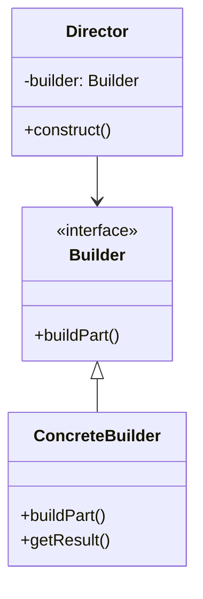

java
```
class PizzaBuilder {
    private String masa;
    public PizzaBuilder setMasa(String m) { this.masa = m; return this; }
    public Pizza build() { return new Pizza(masa); }
}
```
python
```
class PizzaBuilder:
    def __init__(self):
        self.masa = None
    def set_masa(self, masa):
        self.masa = masa
        return self
    def build(self):
        return Pizza(self.masa)
```

## 10 Composite
*Categoría: Estructural
* Propósito: Permite componer objetos en estructuras de árbol para representar jerarquías de parte-todo.
* **Estructura UML:**
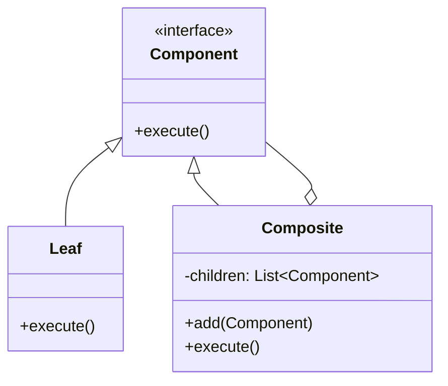

java
```
interface Component { void execute(); }
class Composite implements Component {
    private List<Component> children = new ArrayList<>();
    public void execute() { children.forEach(Component::execute); }
}
```
python
```
class Component:
    def execute(self): pass

class Composite(Component):
    def __init__(self):
        self.children = []
    def execute(self):
        for child in self.children: child.execute()

```


## 11 Decorator
*Categoría: Estructural
* Propósito: Permite añadir funcionalidades a objetos dinámicamente envolviéndolos en objetos decoradores.
* **Estructura UML:**
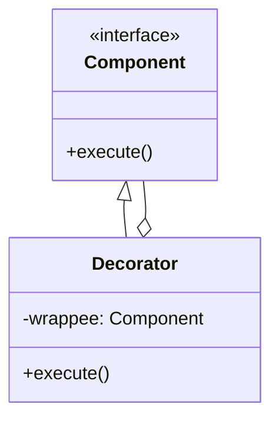

java
```
class Decorator implements Component {
    protected Component component;
    public Decorator(Component c) { this.component = c; }
    public void execute() { component.execute(); }
}
```
python
```
class Decorator(Component):
    def __init__(self, component):
        self._component = component
    def execute(self):
        self._component.execute()
```

## 12 Command
*Categoría: Comportamiento
* Propósito: Transforma una solicitud en un objeto independiente que contiene toda la información sobre la misma.
* **Estructura UML:**
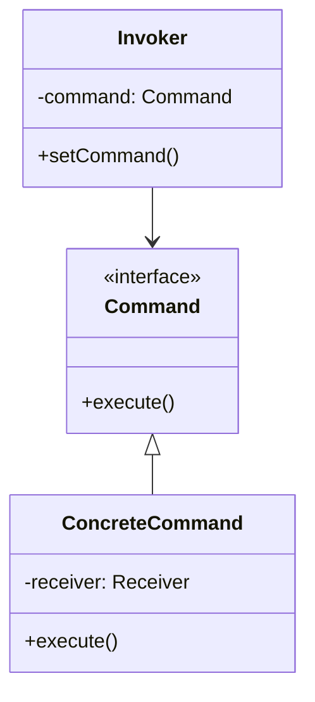

java
```

interface Command { void execute(); }
class SimpleCommand implements Command {
    public void execute() { System.out.println("Comando ejecutado"); }
}

```

python
```
class Command:
    def execute(self): pass

class SimpleCommand(Command):
    def execute(self):
        print("Comando ejecutado")

```


## 13 State
*Categoría: Comportamiento
* Propósito: Permite que un objeto altere su comportamiento cuando su estado interno cambia.
* **Estructura UML:**
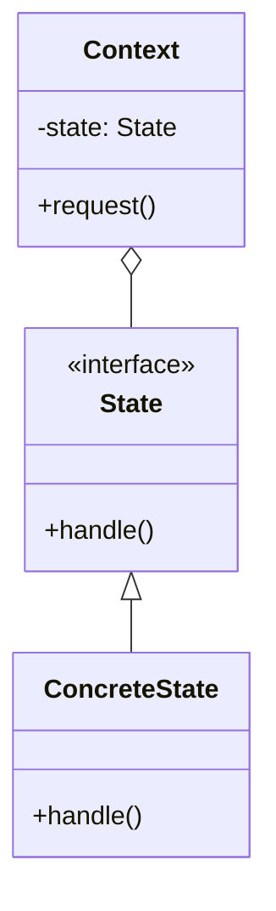

java
```
interface State { void handle(Context ctx); }
class Context {
    private State state;
    public void setState(State s) { this.state = s; }
    public void request() { state.handle(this); }
}
```

python
```
class State:
    def handle(self, context): pass

class Context:
    def __init__(self, state):
        self._state = state
    def request(self):
        self._state.handle(self)


```

## 14 Bridge
*Categoría: Estructural
* Propósito:Desacopla una abstracción de su implementación para que ambas puedan variar independientemente (separa la jerarquía lógica de la jerarquía física).
* **Estructura UML:**
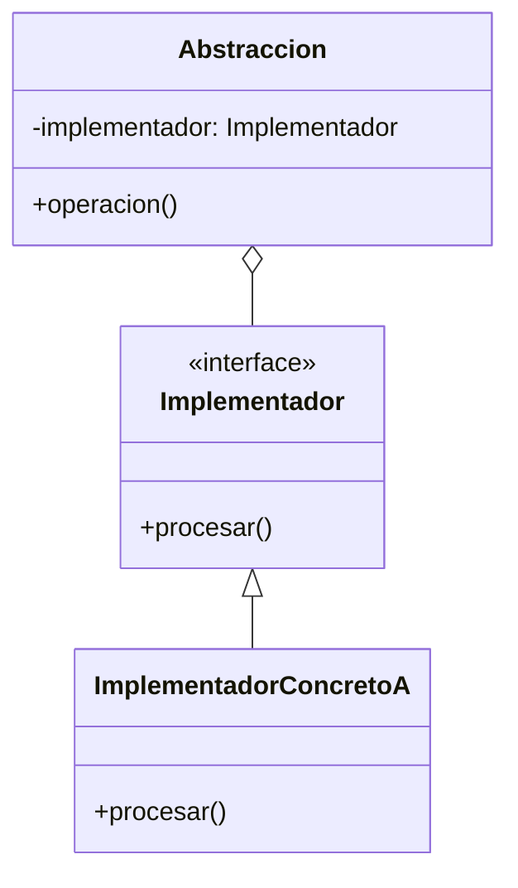

java
```
// Implementador (Interfaz)
interface Dispositivo {
    void encender();
    void apagar();
}

// Implementaciones Concretas
class TV implements Dispositivo {
    public void encender() { System.out.println("TV encendida"); }
    public void apagar() { System.out.println("TV apagada"); }
}

class Radio implements Dispositivo {
    public void encender() { System.out.println("Radio encendida"); }
    public void apagar() { System.out.println("Radio apagada"); }
}

// Abstracción
abstract class ControlRemoto {
    protected Dispositivo dispositivo;

    public ControlRemoto(Dispositivo d) {
        this.dispositivo = d;
    }

    public abstract void botonPower();
}

class ControlAvanzado extends ControlRemoto {
    public ControlAvanzado(Dispositivo d) { super(d); }

    public void botonPower() {
        System.out.println("Enviando señal remota...");
        dispositivo.encender();
    }
}

```

python
```
# Implementador
class Dispositivo:
    def encender(self): 
        pass

class TV(Dispositivo):
    def encender(self):
        print("TV encendida")

class Radio(Dispositivo):
    def encender(self):
        print("Radio encendida")

# Abstracción
class ControlRemoto:
    def __init__(self, dispositivo):
        self.dispositivo = dispositivo

    def boton_power(self):
        print("Enviando señal...")
        self.dispositivo.encender()

# Uso
tv = TV()
control = ControlRemoto(tv)
control.boton_power()


```


  
